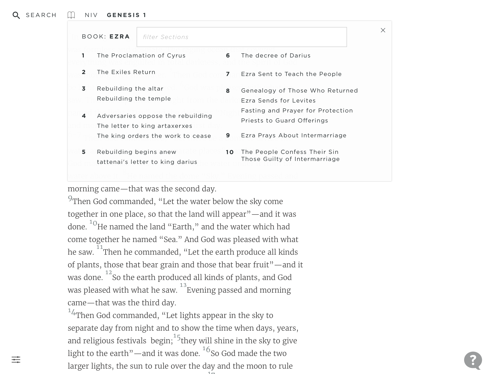
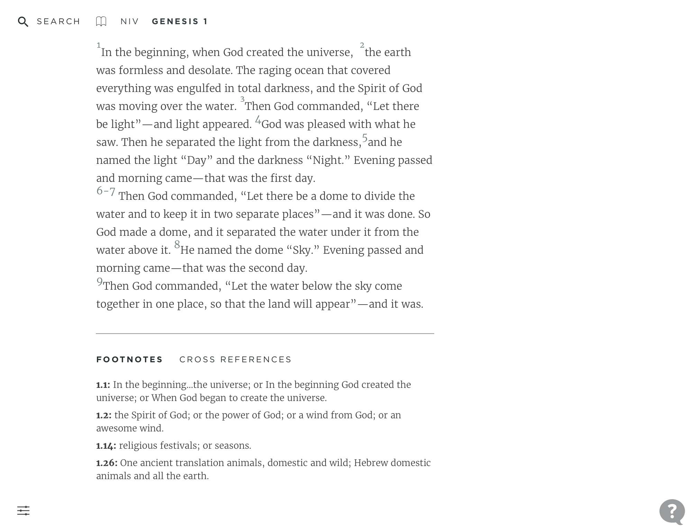
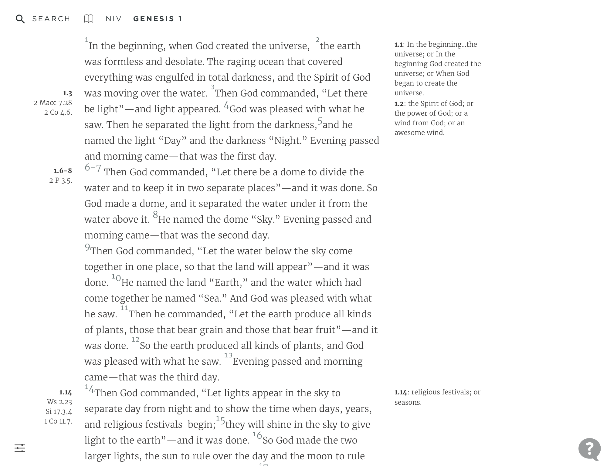
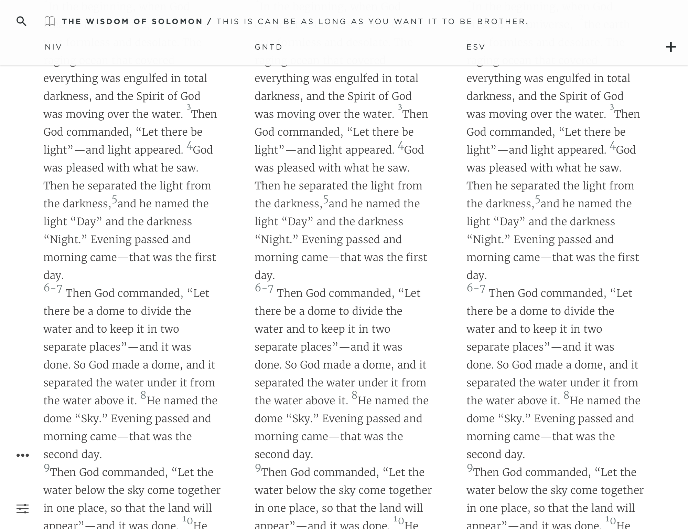
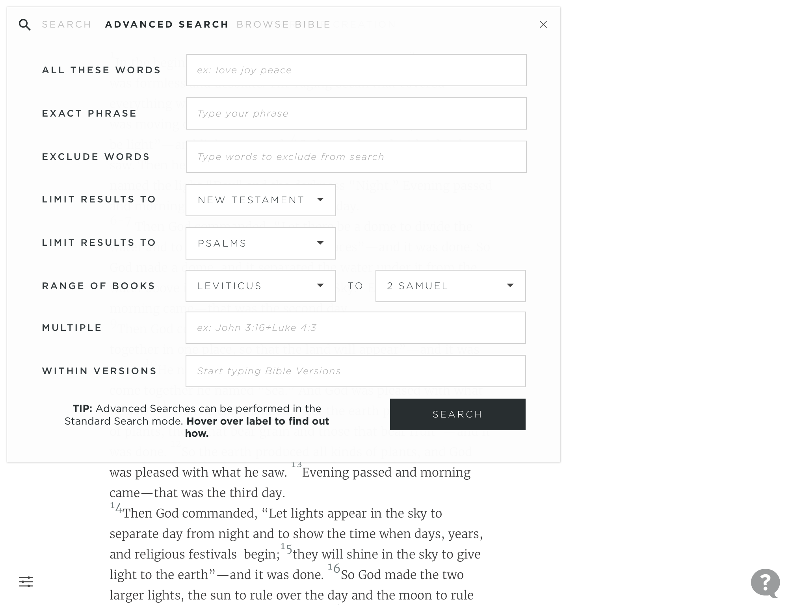
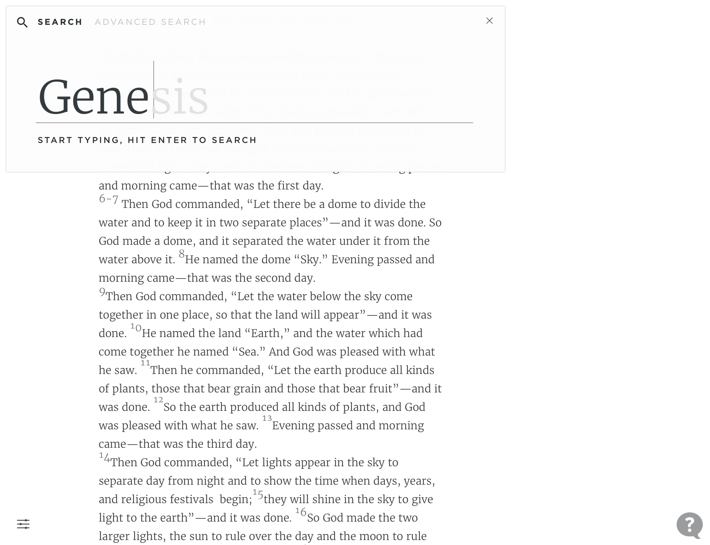
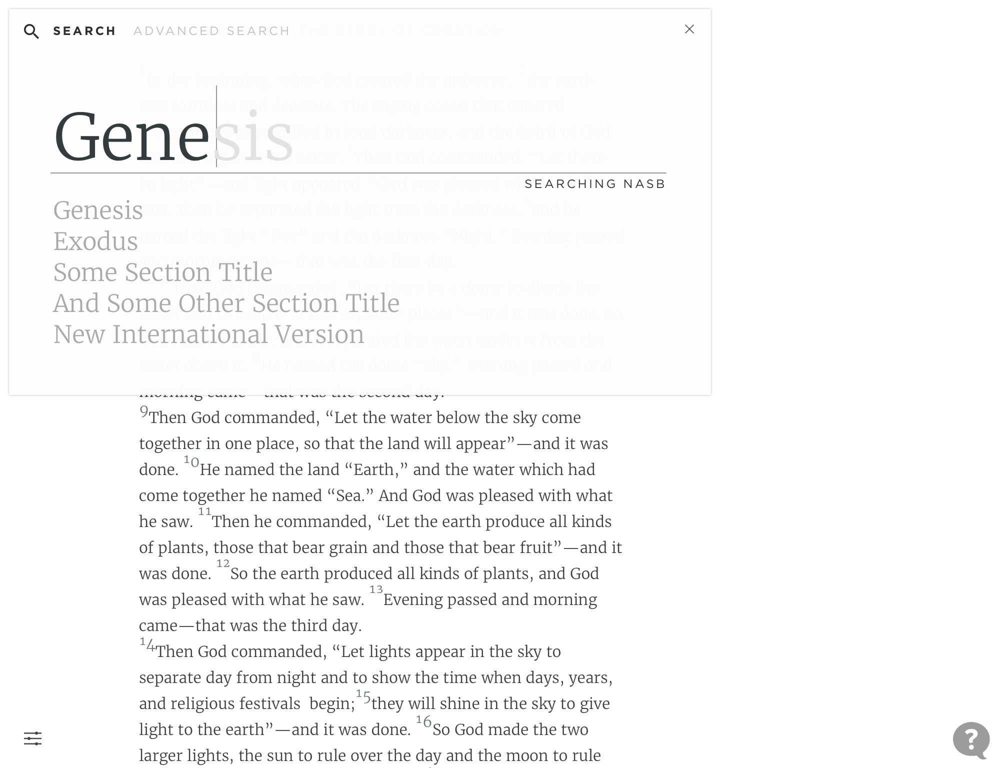
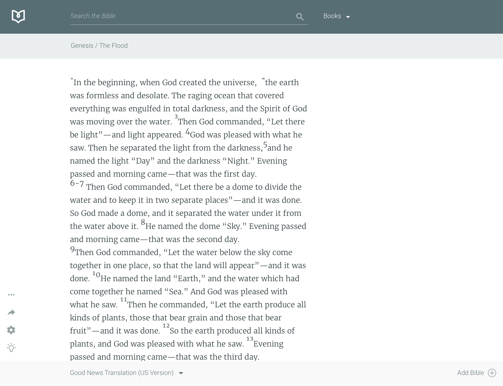
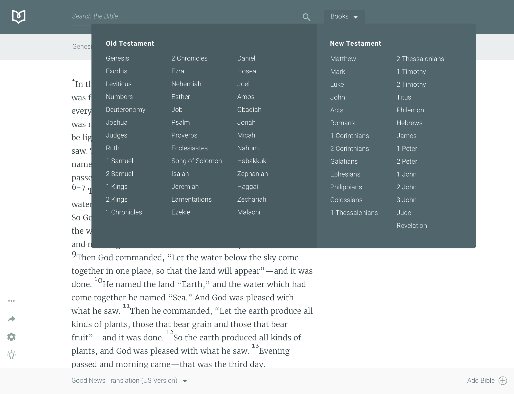

## Proof of Concepts are FUN!

We skipped all the normal planning, discovery, brainstorming sessions and dove right in. Two devs began setting up the environments, repos, and project structure while I was quick at work pushing pixels in Sketch App. I completed 50% of the basic UI in 2 hours and the backend guys starting laying down code. The next seven images you see here are just about all we had for mockups before we decided to switch over to completing the rest of the design/project in the browser.

Sadly this project was just a test of new tech stack and a trial to see how much this team could get done in a few days. The project did get published to the web but unfortunately the cost of keeping it up for fun was just not in the budget. You can imagine how awesome it was from the following images. 😂🤯

## Unused Designs

These are a few design concepts that we moved away from pretty quickly in favor of a more hyper-minimalist style. Enjoy.

